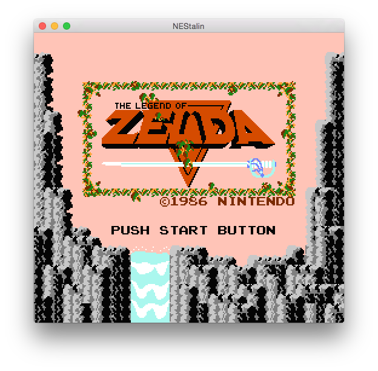
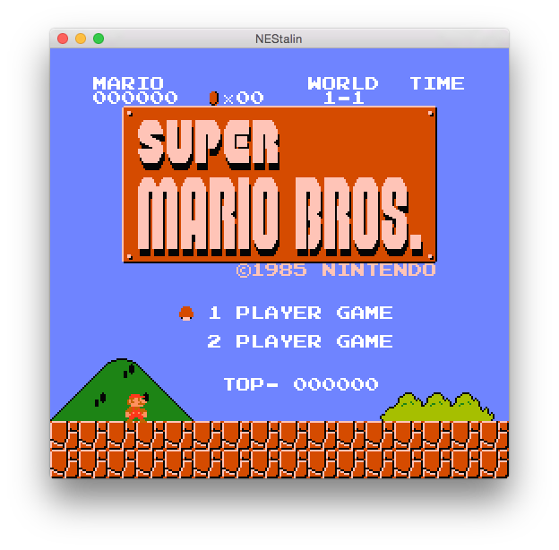
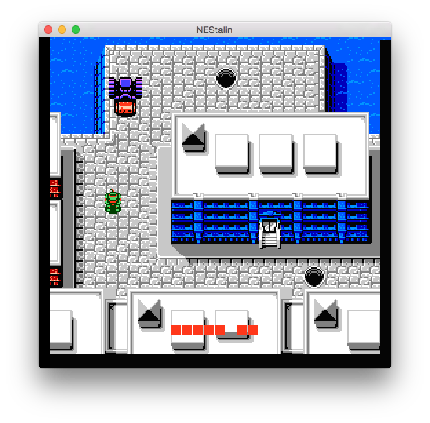

# NEStalin
Copyright © 2014-2015 Manuel Sainz de Baranda y Goñi.  
To be released under the terms of the [GNU General Public License v3](http://www.gnu.org/copyleft/gpl.html).

### What is NEStalin?
NEStalin is a Nintendo Entertainment System emulator. Its core is being developed in C/C++ and it's platform-independent. It will be released soon for Linux, Windows, OS X, iOS and Android.

### Want to help?
Please, make a small donation to support the development of this software.

CURRENCY|ADDRESS
:---:|:---:
[Bitcoin](https://bitcoin.org)|`16Nu1Smx6Dymj9onnWmehPkACqs6xF3Bj4`
[Litecoin](https://litecoin.org)|`LM31aXyh2nNJDNWF7j2Ds8QNemuP8eUHuN`
[DogeCoin](http://dogecoin.com)|`DMpowbgKbgUbU73ABW9NwaVkvcc4fG5bUc`
[MaxCoin](http://www.maxcoin.co.uk)|`mSk8Ji1K6YBqfrKHk1uMsjpnjx91hcCDwR`
